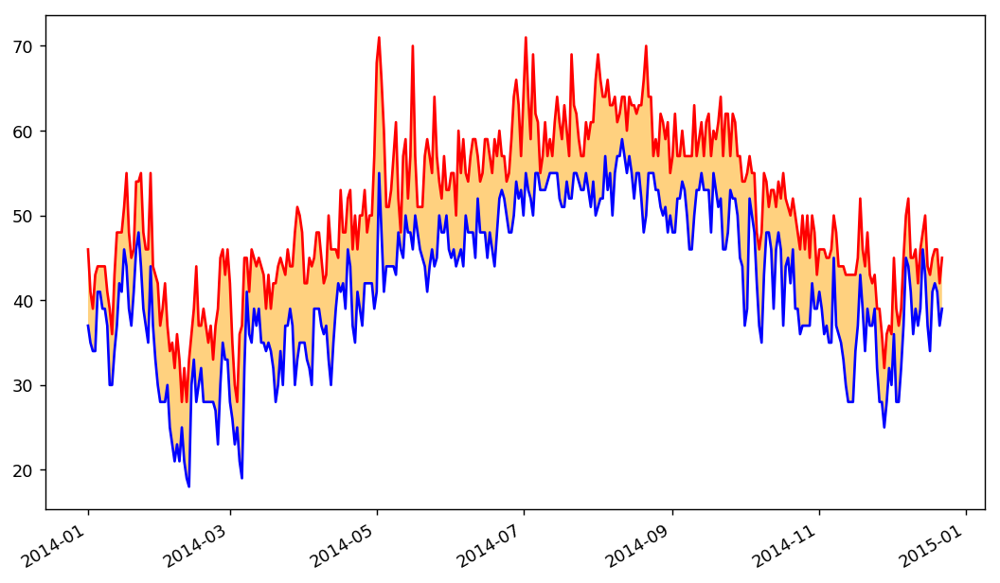

### CSV reading 


```python
import csv

filename = 'sitka_weather_07-2014.csv'
with open(filename) as f:
    reader = csv.reader(f)
    header_row = next(reader)
    print(header_row)
    
    # for row in reader:
    #    highs.append(row[1])
```

    ['AKDT', 'Max TemperatureF', 'Mean TemperatureF', 'Min TemperatureF', 'Max Dew PointF', 'MeanDew PointF', 'Min DewpointF', 'Max Humidity', ' Mean Humidity', ' Min Humidity', ' Max Sea Level PressureIn', ' Mean Sea Level PressureIn', ' Min Sea Level PressureIn', ' Max VisibilityMiles', ' Mean VisibilityMiles', ' Min VisibilityMiles', ' Max Wind SpeedMPH', ' Mean Wind SpeedMPH', ' Max Gust SpeedMPH', 'PrecipitationIn', ' CloudCover', ' Events', ' WindDirDegrees']
    


```python
# 调整x坐标轴使之不重叠, 填充颜色
import csv
from datetime import datetime
import matplotlib.pyplot as plt

filename = 'sitka_weather_2014.csv'
with open(filename) as f:
    reader=csv.reader(f)
    header_row=next(reader)
    
    dates,highs,lows=[],[],[]
    for row in reader:
        current_date = datetime.strptime(row[0],'%Y-%m-%d')
        dates.append(current_date)
        
        high = int(row[1])
        highs.append(high)
        
        low = int(row[3])
        lows.append(low)
        
fig = plt.figure(dpi = 128, figsize=(10,6))
plt.plot(dates,highs,c='red')
plt.plot(dates,lows,c='blue')
plt.fill_between(dates,highs,lows,facecolor='orange',alpha=0.5)
fig.autofmt_xdate()
plt.show()
```




