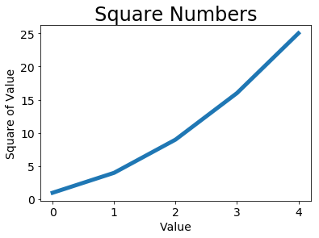

### change label font & plot line thickness


```python
import matplotlib.pyplot as plt 
%matplotlib inline
```


```python
squares = [1,4,9,16,25]
plt.plot(squares, linewidth =5)
plt.title('Square Numbers',fontsize=24)
plt.xlabel('Value',fontsize=14)
plt.ylabel('Square of Value',fontsize=14)
plt.tick_params(axis='both',labelsize=14)
plt.show()
```




