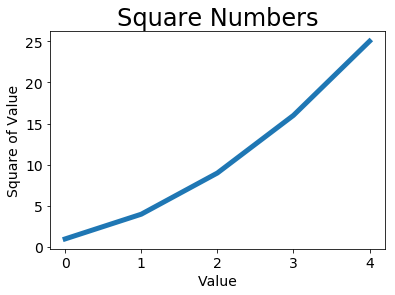
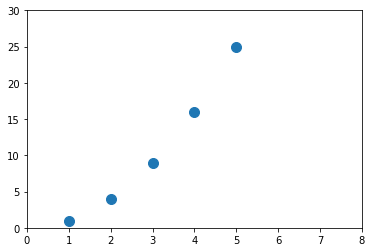
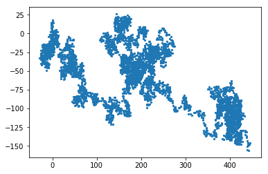
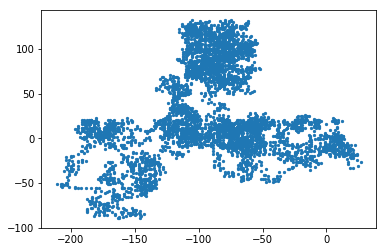
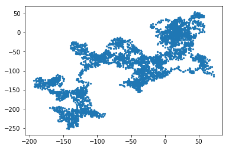
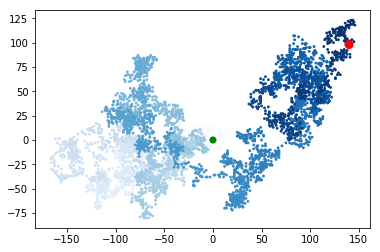
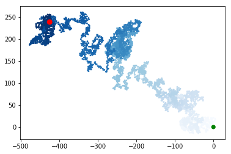

### change label font & plot line thickness


```python
import matplotlib.pyplot as plt 
%matplotlib inline
```


```python
squares = [1,4,9,16,25]
plt.plot(squares, linewidth =5)  # plt.plot(x,y) 画出x,y轴的值
plt.title('Square Numbers',fontsize=24)
plt.xlabel('Value',fontsize=14)
plt.ylabel('Square of Value',fontsize=14)
plt.tick_params(axis='both',labelsize=14)  #设置刻度标记的大小
plt.show()
```





```python
# 画出x轴，y轴
x_values = [1,2,3,4,5]
y_values = [1,4,9,16,25]
plt.scatter(x_values,y_values,s=100)
plt.axis([0,8,0,30])
```


    [0, 8, 0, 30]





```python
plt.savefig('squares_plot.png',bbox_inches='tight')
```

### RandomWalk( ) 类 


```python
from random import choice

class RandomWalk():
    
    def __init__(self, num_points=5000):
        self.num_points = num_points
        
        self.x_values=[0]
        self.y_values=[0]
        
    def fill_walk(self):
        
        while len(self.x_values) < self.num_points:
            x_direction = choice([1,-1])
            x_distance = choice([0,1,2,3,4])
            x_step = x_direction * x_distance
            
            y_direction = choice([1,-1])
            y_distance = choice([0,1,2,3,4])
            y_step = y_direction * y_distance
            
            # avoid step still(not moving)
            if x_step == 0 and y_step == 0 :
                continue
            
            next_x = self.x_values[-1] + x_step
            next_y = self.y_values[-1] + y_step
            
            self.x_values.append(next_x)
            self.y_values.append(next_y)
```


```python
# plot
import matplotlib.pyplot as plt

# from random_walk import RandomWalk
rw = RandomWalk()
rw.fill_walk()
plt.scatter(rw.x_values, rw.y_values, s=5)
plt.show()
```





```python
# console decide whether to continue.
import matplotlib.pyplot as plt
# from random_walk import RandomWalk

while True:
    rw = RandomWalk()
    rw.fill_walk()
    plt.scatter(rw.x_values, rw.y_values, s=5)
    plt.show()
    
    keep_running = input('Make another walk? (y/n):')
    if keep_running == 'n':
        break
```





    Make another walk? (y/n):y
    





    Make another walk? (y/n):n
    


```python
# change color 
import matplotlib.pyplot as plt
# from random_walk import RandomWalk

while True:
    rw = RandomWalk()
    rw.fill_walk()
    
    point_numbers = list(range(rw.num_points))
    plt.scatter(rw.x_values, rw.y_values,c=point_numbers, cmap=plt.cm.Blues, edgecolor='none', s=8)
    
    
    # highlight start and end
    plt.scatter(0,0,c='green',edgecolors='none',s=50)
    plt.scatter(rw.x_values[-1],rw.y_values[-1],c='red', edgecolors='none', s=80)
    
    plt.show()
    
    keep_running = input('Make another walk? (y/n):')
    if keep_running == 'n':
        break
```





    Make another walk? (y/n):y
    





    Make another walk? (y/n):n
    
